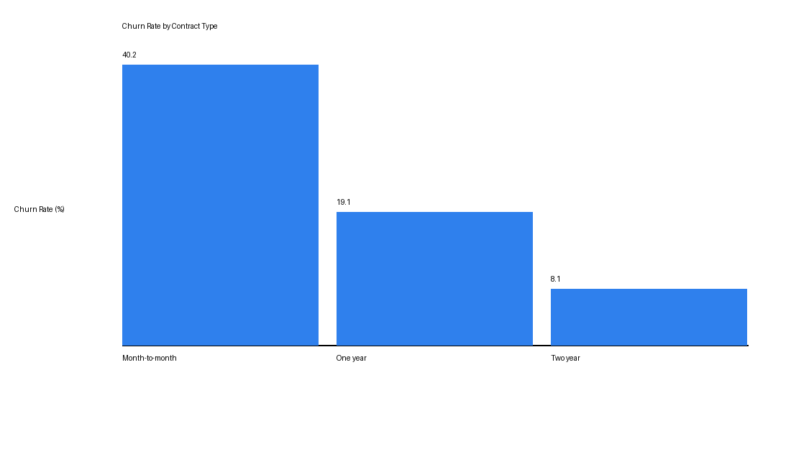
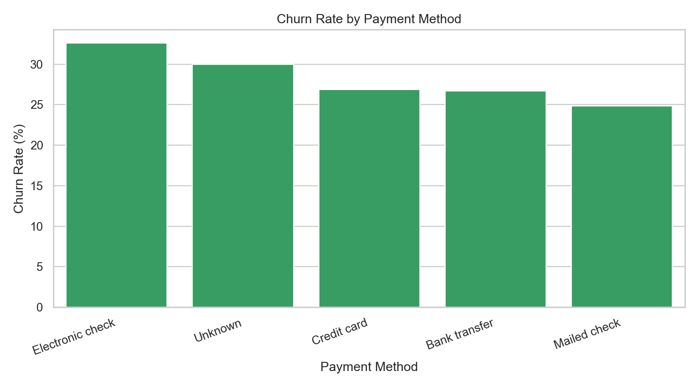
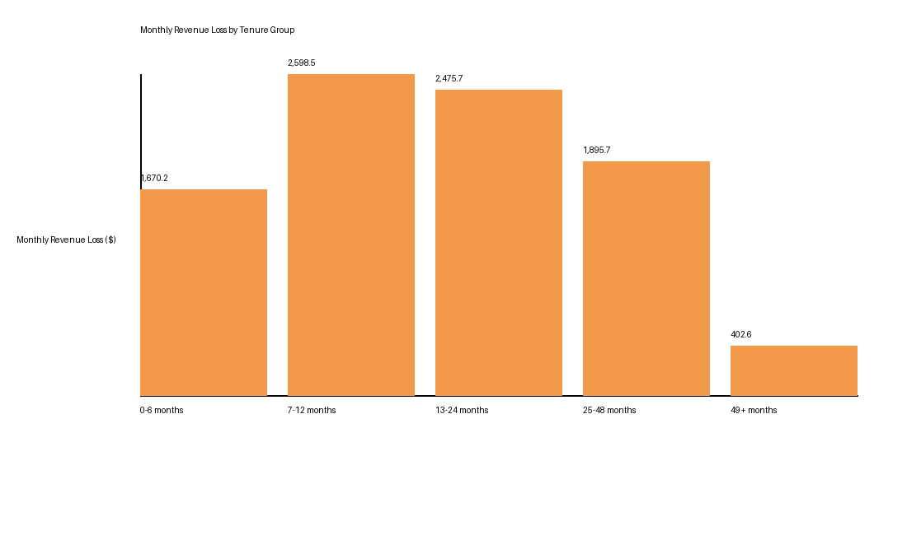

# Netflix Customer Churn & Revenue Insights Dashboard

## Project Overview

This is a complete portfolio-ready data analytics project for a Netflix-style streaming subscription company. It generates a realistic synthetic customer churn dataset, cleans and transforms the data with Python, documents SQL analysis workflows, performs exploratory analysis in a Jupyter notebook, and exports Tableau/Power BI-ready CSV files.

The project is designed to show an end-to-end analytics workflow: data generation, cleaning, feature engineering, SQL analysis, exploratory data analysis, dashboard preparation, and business recommendations.

## View The Results

Visitors do not need to run the project to understand the analysis. The main results are already included in this repository:

| Result | File |
| --- | --- |
| Executive summary and recommendations | [reports/executive_summary.md](reports/executive_summary.md) |
| Full EDA notebook | [notebooks/customer_churn_eda.ipynb](notebooks/customer_churn_eda.ipynb) |
| Dashboard-ready CSV files | [dashboard/](dashboard/) |
| SQL analysis queries | [sql/](sql/) |
| Python data pipeline | [src/run_pipeline.py](src/run_pipeline.py) |

### Key Metrics

| Metric | Value |
| --- | ---: |
| Total customers analyzed | 1,500 |
| Churned customers | 424 |
| Overall churn rate | 28.27% |
| Monthly recurring revenue | $29,980.83 |
| Lost monthly recurring revenue | $9,042.66 |
| Estimated annual revenue loss | $108,511.92 |

### Chart Preview







## Business Problem

Streaming subscription companies lose revenue when customers cancel. Leadership needs to understand which customer segments churn most often, how much recurring revenue is being lost, and which retention actions could reduce churn.

This project answers questions such as:

- What is the overall churn rate?
- Which contract types and payment methods have the highest churn?
- Are newer customers more likely to churn?
- How much monthly and annual revenue is lost from churned customers?
- Which customer segments should retention teams prioritize?

## Objectives

- Build a clean and realistic customer churn dataset.
- Remove duplicates, clean missing values, and fix data types.
- Create tenure groups and revenue loss metrics.
- Analyze churn trends using Python and SQL.
- Produce dashboard-ready CSV files for Tableau or Power BI.
- Summarize insights and business recommendations in a professional format.

## Tools Used

- Python
- Pandas
- NumPy
- Matplotlib
- Seaborn
- SQLite/PostgreSQL-compatible SQL
- Jupyter Notebook
- Tableau or Power BI-ready CSV outputs

## Project Structure

```text
customer-churn-analytics/
├── data/
│   ├── raw/
│   │   └── customer_churn_raw.csv
│   └── processed/
│       └── cleaned_customer_churn.csv
├── sql/
│   ├── 01_create_tables.sql
│   ├── 02_data_cleaning_queries.sql
│   ├── 03_churn_analysis.sql
│   ├── 04_revenue_analysis.sql
│   └── 05_customer_segmentation.sql
├── notebooks/
│   └── customer_churn_eda.ipynb
├── src/
│   ├── analysis_exports.py
│   ├── create_visuals.py
│   ├── data_cleaning.py
│   ├── generate_sample_data.py
│   └── run_pipeline.py
├── dashboard/
│   ├── cleaned_customer_churn.csv
│   ├── churn_summary.csv
│   ├── revenue_loss_summary.csv
│   └── segment_analysis.csv
├── reports/
│   ├── data_dictionary.md
│   └── executive_summary.md
├── images/
├── README.md
├── requirements.txt
└── .gitignore
```

## Dataset Description

The generated sample dataset contains customer-level streaming subscription records with the following fields:

| Column | Description |
| --- | --- |
| customer_id | Unique customer identifier |
| gender | Customer gender category |
| age_group | Customer age band |
| tenure | Number of months subscribed |
| contract_type | Month-to-month, One year, or Two year |
| payment_method | Customer payment method |
| monthly_charges | Monthly subscription charge |
| total_charges | Estimated lifetime charges |
| streaming_plan | Mobile, Basic, Standard, or Premium |
| support_tickets | Count of customer support tickets |
| churn_status | Churned or Stayed |
| churn_reason | Reason for churn or Not churned |

The raw dataset intentionally includes duplicate rows and a small number of missing values so the cleaning workflow is realistic.

## Project Workflow

1. Generate sample raw Netflix-style streaming customer data with realistic churn patterns.
2. Load the raw CSV into Python using Pandas.
3. Standardize text fields, remove duplicate customers, and fix numeric data types.
4. Fill missing total charges and payment method values.
5. Create tenure groups for customer lifecycle analysis.
6. Create monthly and annual revenue loss metrics.
7. Export cleaned and summarized CSV files for dashboards.
8. Analyze churn and revenue trends with SQL and Jupyter Notebook.
9. Document insights, recommendations, and future improvements.

## SQL Analysis

The `sql/` folder contains SQL files for a database-based workflow:

- `01_create_tables.sql`: Creates raw and cleaned customer churn tables.
- `02_data_cleaning_queries.sql`: Cleans raw data, removes duplicates, creates tenure groups, and calculates revenue loss.
- `03_churn_analysis.sql`: Calculates overall churn rate and churn by contract, payment method, tenure group, and churn reason.
- `04_revenue_analysis.sql`: Quantifies lost monthly recurring revenue and estimated annual revenue loss.
- `05_customer_segmentation.sql`: Builds customer segment analysis for retention targeting.

These queries are written with simple SQL patterns that can be adapted for SQLite or PostgreSQL.

## Dashboard Ideas

Recommended Tableau or Power BI pages:

- Executive KPI Overview: total customers, churn rate, churned customers, MRR, and revenue loss.
- Churn Drivers: churn by contract type, payment method, tenure group, and churn reason.
- Revenue Loss: monthly and annual revenue loss by segment.
- Customer Segmentation: churn rate by age group, internet service, support tickets, and tenure.
- Retention Priority View: high-value churned customers and high-risk active segments.

Suggested dashboard filters:

- Contract type
- Payment method
- Tenure group
- Streaming plan
- Age group
- Churn status

## Key Insights

Based on the generated sample dataset:

- The cleaned dataset contains 1,500 unique customers.
- 424 customers churned, producing an overall churn rate of 28.27%.
- Total monthly recurring revenue is $29,980.83.
- Lost monthly recurring revenue from churned customers is $9,042.66.
- Estimated annualized revenue loss is $108,511.92.
- Month-to-month customers have the highest churn rate at 40%.
- Customers with 0-6 months of tenure have the highest tenure-based churn rate at 48%.
- Electronic check customers have the highest payment-method churn rate at 35%.
- Competitor offers and price concerns are the most common churn reasons.

## Business Recommendations

- Improve onboarding for customers in their first 6 months because early-tenure customers are the highest-risk group.
- Create incentives for month-to-month customers to move into annual contracts.
- Review pricing strategy and competitor positioning because price and competitor offers are frequent churn reasons.
- Use support ticket volume as an early warning signal for churn risk.
- Build targeted retention campaigns for customers with high monthly charges and short tenure.

## How to Run the Project

Create and activate a virtual environment, then install the requirements:

```bash
pip install -r requirements.txt
```

Run the full pipeline from the project root:

```bash
python src/run_pipeline.py
```

Run individual steps if needed:

```bash
python src/generate_sample_data.py
python src/data_cleaning.py
python src/analysis_exports.py
python src/create_visuals.py
```

Open the EDA notebook:

```bash
jupyter notebook notebooks/customer_churn_eda.ipynb
```

## Dashboard-Ready Outputs

The `dashboard/` folder contains:

- `cleaned_customer_churn.csv`
- `churn_summary.csv`
- `revenue_loss_summary.csv`
- `segment_analysis.csv`

These files can be imported directly into Tableau, Power BI, Excel, or Google Sheets.

## Resume-Ready Project Description

Built an end-to-end Netflix-style customer churn analytics project for a streaming subscription business using Python, SQL, and dashboard-ready CSV outputs. Generated and cleaned a realistic synthetic customer dataset, engineered tenure and revenue loss metrics, performed exploratory analysis in Jupyter Notebook, wrote SQL queries for churn and revenue analysis, and developed business recommendations to reduce churn and protect recurring revenue.

## Future Improvements

### Beginner Improvements

- Add more charts to the EDA notebook.
- Create a Tableau or Power BI dashboard using the exported CSV files.
- Add more churn reason categories.
- Add a simple monthly trend column to analyze churn over time.

### Intermediate Improvements

- Load the cleaned CSV into SQLite and run the SQL files end to end.
- Add automated data quality checks for duplicates, missing values, and invalid categories.
- Create customer cohorts based on signup month.
- Add a churn risk score using rule-based segmentation.

### Advanced Improvements

- Build a machine learning churn prediction model.
- Add model evaluation metrics such as precision, recall, F1-score, and ROC-AUC.
- Create a retention uplift analysis to estimate campaign impact.
- Connect the pipeline to PostgreSQL and schedule it with Airflow or GitHub Actions.
- Build an interactive dashboard with drill-through views and retention scenario modeling.

## Notes

This project uses generated sample data, so it is safe to publish publicly. The dataset is realistic enough for portfolio analysis but does not contain real customer information. It is not official Netflix data and is not affiliated with Netflix.
